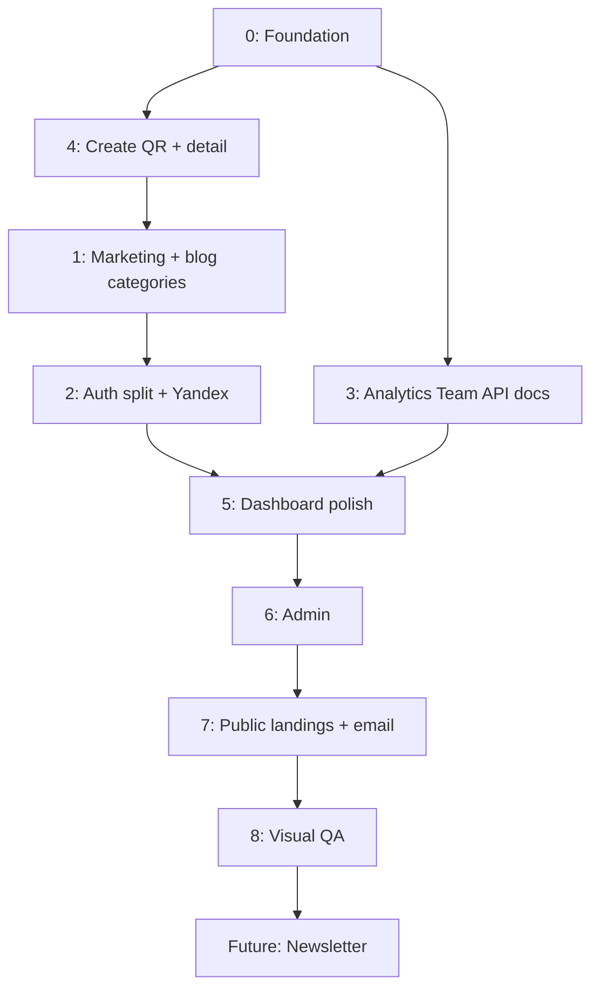

# План внедрения визуала QR-S.ru

**Версия:** 2.0 (зафиксировано по ответам пользователя)  
**Дата:** 2026-07-23  
**Источники:** `temp/` (HTML-макеты, DS bundle, скриншоты), код `src/styles/design-system/`, исследование агента `077d114d-2678-44e4-b602-b2b1e76a8e03`  
**Статус:** этапы **0–8 завершены** (Visual QA sign-off 2026-07-23). Rollout UI закрыт; known gaps — ниже.

> **Следующий этап продукта (не UI):** [`PRODUCT-READINESS-PLAN.md`](./PRODUCT-READINESS-PLAN.md) — активация, лимиты, Метрика-цели, SEO-сегменты, волны B/C.  
> Короткий ops-чеклист также в [`README.md`](../README.md) → «Не забыть».

---

## Краткий вердикт

| Параметр | Оценка |
|----------|--------|
| Готовность материалов | **8/10** — все ключевые HTML-референсы покрыты; mobile/dark PNG от пользователя — pending |
| Прогресс в коде | **~95%** — stages 0–8 done; Playwright CI — рекомендация |
| Критический путь | **Закрыт** (этап 4 + pixel QA) |
| Оценка сроков | Rollout UI **завершён**; future: newsletter, forgot-password, SMTP |

**Приоритет выполнения (без заглушек):** `0 → 4 → 1 → 2 → 3 → 5 → 6 → 7 → 8`

---

## Зафиксированные решения (locked)

| Тема | Решение |
|------|---------|
| **Admin** | По аналогии с обычным `DashboardShell` — те же паттерны header/card/table, отдельный `AdminShell` |
| **Login / Register** | Split-layout по референсу: `temp/screenshots/login-register-ref.png` (скопирован из макета пользователя) |
| **Social auth** | **Только Яндекс** — в UI заменить Google/VK с макета на кнопку «Войти через Яндекс» (`/api/auth/yandex`) |
| **QR detail** (`/dashboard/qr/[id]`) | **Analytics-heavy** — stat cards, графики, scan breakdown; не compact card |
| **API Docs** (`/dashboard/api-docs`) | **Sidebar как у Stripe** — фиксированная навигация по разделам + content area |
| **Публичные QR-лендинги** (`/p/[code]`, `landing-templates/*`) | **Полный редизайн** в стиле DS (не только токены) |
| **Mobile + dark эталоны** | Пользователь предоставит PNG **позже**; до этого — token-based QA + HTML-референсы |
| **Empty / error / loading** | Делаем сами по DS (`Alert`, skeleton, empty states из `feedback.css`) |
| **Hero / favicon / OG** | Как в дизайне (`HomeHeroVisual`, site-settings / static assets) |
| **Blog chips** | **Полностью:** UI + модель категорий в Prisma + реальная серверная фильтрация |
| **Newsletter** | **Не в текущем rollout** — отдельный будущий этап (см. [Future: Newsletter](#future-newsletter)) |
| **Email-шаблоны** | **В scope** текущего rollout |

---

## Data Safety — обязательные ограничения (production)

> **Сервис в проде с клиентами. Потеря данных недопустима.**

### Запрещено на production без явного бэкапа и согласования

- `prisma migrate reset`
- `DROP TABLE` / `DROP COLUMN` / `TRUNCATE`
- `prisma db push --accept-data-loss`
- Любые destructive SQL-миграции
- Массовое удаление или перезапись объектов в S3 (аватары, QR-файлы, blog media, workspace uploads)

### Предпочтительная стратегия схемы

1. **Additive-only** изменения Prisma: новые таблицы/колонки, nullable FK, default values.
2. Переход на **`prisma migrate`** для контролируемых миграций (вместо `db push` на проде).
3. Единственное ожидаемое schema change в rollout: **категории блога** (`BlogCategory` + optional `categoryId` на `BlogPost`) — только additive.
4. UI-редизайн **не затрагивает** бизнес-данные: `QrCode`, `ScanEvent`, `User`, `Workspace`, `Subscription`, `Payment`, `UploadedFile` metadata.

### Pre-deploy checklist (каждый релиз с миграцией)

- [ ] **Бэкап Postgres** (snapshot / `pg_dump`) с фиксацией timestamp и пути восстановления
- [ ] Миграция прогнана на **staging** или **локальной копии prod-дампа**
- [ ] `prisma migrate deploy` (не `db push`) на staging → smoke test критичных флоу (login, create QR, scan redirect, billing read)
- [ ] **Rollback path** документирован: предыдущий Docker image / git tag + обратная миграция или forward-fix plan
- [ ] S3: деплой не трогает существующие ключи клиентов; новые ассеты — только add/update по известным путям
- [ ] Нет изменений в encode/redirect логике `/r/[slug]`, `/p/[code]` без отдельного QA

### Что безопасно менять визуально (без миграций)

- CSS tokens, React components, layouts, shells
- Статические маркетинговые страницы
- Dashboard/admin UI (read/write те же API)
- Email HTML/CSS шаблоны (новые файлы, не трогают БД)
- Публичные landing templates (только presentation layer)

---

## Инвентаризация `temp/`

### HTML-макеты

| Файл | Покрытие |
|------|----------|
| `Главная QR-S.dc.html` | Лендинг: hero → footer, pricing, FAQ, blog teaser |
| `Блог QR-S.dc.html` | Список: chips, featured, grid, pagination, newsletter block (UI only) |
| `Статья QR-S.dc.html` | TOC, prose, compare, related, share |
| `Кабинет QR-S.dc.html` | Shell + 10 вкладок: overview, create grid, library, analytics, billing, profile, bulk, team, api-keys, generic |
| `Создание QR.dc.html` | Мастер URL: static/dynamic, tabs, accordions, sticky preview |

### Design System

- Канонический runtime: `src/styles/design-system/` (скопирован из `temp/_ds/design-system-…/`)
- Не импортировать в прод: `finance/*`, `support.js`, `_ds_bundle.js`
- Readme про «Финкуратор» — контекст DS, не бренд QR-S

### Скриншоты

| Файл | Назначение |
|------|------------|
| `temp/screenshots/blog-*.png`, `article-*.png` | QA блога/статьи (desktop, light) |
| `temp/screenshots/login-register-ref.png` | **Эталон auth** split-layout |

**Ожидаются от пользователя:** mobile (390px) и dark theme PNG для ключевых экранов.

### Breakpoints (контракт)

| Token | px | Использование |
|-------|-----|---------------|
| `mobile-sm` | ≤560 | Footer 1 col, скрытие meta |
| `mobile` | ≤620 | Type grid 2 col |
| `tablet` | ≤760 | Grids → 1 col |
| `nav` | ≤900 | Public nav → burger |
| `sidebar` | ≤980 | Dashboard sidebar → drawer |
| `desktop` | ≥981 | Full layout |

---

## Карта референс → роуты

### Прямое соответствие (HTML есть)

| Референс | Роуты |
|----------|-------|
| `Главная QR-S.dc.html` | `/` |
| `Блог QR-S.dc.html` | `/blog` (+ Prisma categories) |
| `Статья QR-S.dc.html` | `/blog/[slug]` |
| `Кабинет QR-S.dc.html` | `/dashboard`, `/dashboard/analytics`, `/dashboard/team`, `/dashboard/billing`, `/dashboard/profile`, `/dashboard/bulk`, `/dashboard/api-keys`, `/dashboard/library`, `/dashboard/create` |
| `Создание QR.dc.html` | `/dashboard/create/[type]`, `/dashboard/qr/[id]/edit` |
| `login-register-ref.png` | `/login`, `/register` |

### Экстраполяция (решения зафиксированы)

| Роут | Подход |
|------|--------|
| `/dashboard/qr/[id]` | Analytics-heavy detail |
| `/dashboard/api-docs` | Stripe-style sidebar docs |
| `/admin/*` | Dashboard shell patterns |
| `/p/[code]`, `landing-templates/*` | Полный редизайн |
| `/changelog`, legal | Layout статьи без TOC |
| `/g/[slug]`, `/expired`, `/mini` | Centered DS cards |
| Email templates | Новый HTML в стиле DS (Manrope, colors, logo) |

---

## Текущий статус в коде (после этапа 8)

### ✅ Этапы 0–8 — завершены

| Этап | Содержание | Статус |
|------|------------|--------|
| **0** | DS tokens, React-обёртки, breakpoints, globals | ✅ |
| **4** | Create/edit QR wizard, QR detail analytics | ✅ |
| **1** | Маркетинг, blog categories (Prisma), legal/changelog | ✅ |
| **2** | Auth split-layout, Яндекс OAuth | ✅ |
| **3** | Analytics, team, API docs (Stripe sidebar) | ✅ |
| **5** | Dashboard polish (library, billing, profile, bulk, api-keys) | ✅ |
| **6** | Admin shell + CRUD pages | ✅ |
| **7** | Public landings (10 templates), utility pages, email HTML | ✅ |
| **8** | Visual QA, slate cleanup, dark smoke, QA package | ✅ |

### QA-артефакты

- Скриншоты: `temp/screenshots/qa/` (+ `SUMMARY.md`)
- Dark smoke: `*-dark-1280.png`, `*-dark-390.png` (авто, не эталон пользователя)
- Референсы: `temp/*.dc.html`, `temp/screenshots/login-register-ref.png`

### ⚠️ Known gaps (не блокируют sign-off)

| Gap | Статус |
|-----|--------|
| Mobile PNG эталоны от пользователя | **Ожидаются** — pixel-compare отложен |
| Dark theme PNG эталоны от пользователя | **Ожидаются** — token-based QA пройден |
| Newsletter backend | **Future** — UI может отображаться, submit не подключён |
| Forgot-password UI | Нет страницы / backend |
| Email templates + SMTP | HTML готов; prod SMTP — отдельная настройка |
| Playwright visual regression в CI | Рекомендация |
| Dead code: `qr-studio.tsx`, `blog-posts-slider.tsx`, `dashboard-mobile-nav.tsx` | Не в роутах, обновлены под DS |

### Slate policy (этап 8)

- В `src/` **нет** `text-slate-*` / `bg-slate-*` в активном коде.
- Исключение: **compat aliases** в `globals.css` (`.text-slate-500` → `var(--text-muted)` и т.д.) для обратной совместимости.
- Новые компоненты: `qrs-text-*`, `qrs-surface-*`, `fk-*`.

---

## Текущий статус в коде (архив — до rollout)

## Этапы внедрения

### Этап 0 — Foundation lock

**Цель:** единый визуальный фундамент.

**Работы:**
1. Импорт в `globals.css`: `forms.css`, `feedback.css`, `navigation.css` (без `finance/`).
2. React-обёртки: `Input`, `Field`, `Select`, `Badge`, `Accordion`, `Pagination`, `Alert`, `Modal`.
3. Зафиксировать breakpoints (таблица выше).
4. Политика: **новый код — только DS tokens** (`var(--*)`, `fk-*`, `qrs-*`); не добавлять `text-slate-*`.

**Приёмка:**
- Все варианты `fk-button` совпадают с DS
- Dark/light без «белых дыр»
- Нет новых `text-slate-*` в изменённых файлах

**Проверка:** `core.card.html` vs hero CTA на 1280px и 390px.

**Data safety:** только CSS/TS — миграций нет.

---

### Этап 4 — Создание / редактирование QR ⚠️ критический путь

> Выполняется **сразу после этапа 0** (приоритет 0 → **4** → 1).

**Роуты:** `/dashboard/create/[type]`, `/dashboard/qr/[id]`, `/dashboard/qr/[id]/edit`

**Работы:**
1. Рефактор `create-qr-client.tsx` по `Создание QR.dc.html`: page head, static/dynamic toggle, tabs, accordions, sticky preview 380px.
2. `qr-designer.tsx`, `qr-studio.tsx` — DS forms/cards.
3. **QR detail (analytics-heavy):** stat cards, scan chart, geo/device breakdown, recent scans table, actions row — compose из `Кабинет` analytics + library row.
4. Edit — тот же wizard layout что create.

**Приёмка:**
- Grid `1fr 380px` → 1 col на ≤980px
- 20+ типов QR — функциональность сохранена
- Detail page — analytics-first, не card-only

**Проверка:** `Создание QR.dc.html` vs `/dashboard/create/url` на 1280 и 390; static/dynamic; design tab.

**Data safety:** только UI; API и Prisma models QR не менять.

---

### Этап 1 — Маркетинг: доводка 1:1

**Роуты:** `/`, `/blog`, `/blog/[slug]`, `/changelog`, `/privacy-policy`, `/terms-of-service`

**Работы:**
1. Pixel-compare лендинга с `Главная QR-S.dc.html`.
2. **Blog categories (full):**
   - Additive Prisma: `BlogCategory` (id, slug, name, sortOrder) + `BlogPost.categoryId` (nullable FK).
   - Миграция на staging → prod по [checklist](#pre-deploy-checklist-каждый-релиз-с-миграцией).
   - Admin: CRUD категорий или select в blog editor.
   - `/blog`: chips с query `?category=slug`, серверная фильтрация, featured учитывает фильтр.
   - **Newsletter block:** оставить визуально как в макете **или** скрыть до Future — не подключать backend.
3. Статья: TOC, compare, related — сверка с `Статья QR-S.dc.html` и `article-*.png`.
4. Hero / favicon / OG — ассеты из дизайна, `SiteSettings` / `public/`.
5. Legal/changelog — layout статьи без TOC.

**Приёмка:**
- Header 72px, sticky blur; hero gradient; pricing highlight
- Blog chips фильтруют реальные посты
- Article TOC скрыт на ≤960px

**Проверка:** breakpoints 390, 560, 760, 900, 1280, 1440; light + dark; скриншоты в `temp/screenshots/qa/`.

**Data safety:** миграция blog categories — **только additive**; существующие посты без categoryId остаются видимыми («Все»).

---

### Этап 2 — Auth

**Роуты:** `/login`, `/register`

**Работы:**
1. Довести split-layout по `temp/screenshots/login-register-ref.png`.
2. **Только Яндекс** — одна social-кнопка, бренд Яндекс ID.
3. Register — тот же layout + plan features card.
4. Errors/loading — `Alert` из DS.

**Приёмка:** DS Input/Field; mobile — одна колонка; нет Google/VK.

**Data safety:** без миграций.

---

### Этап 3 — Dashboard: analytics, team, API docs

**Роуты:** `/dashboard/analytics`, `/dashboard/team`, `/dashboard/api-docs`

**Работы:**
1. Analytics — из `Кабинет QR-S.dc.html` (stat cards + bar chart).
2. Team — invite + members table.
3. **API Docs — Stripe sidebar:** левая nav (группы endpoints), правая content с code samples, sticky TOC на desktop.

**Приёмка:** sidebar 260px; заголовки `clamp(1.7rem, 4vw, 2.1rem)`; api-docs navigable на mobile (drawer).

**Data safety:** без миграций.

---

### Этап 5 — Dashboard polish

**Роуты:** `/dashboard/library`, `/dashboard/billing`, `/dashboard/profile`, `/dashboard/bulk`, `/dashboard/api-keys`, `/dashboard` (overview)

**Работы:** pixel-pass, empty/error/loading по DS, убрать остатки `text-slate`.

**Приёмка:** визуально согласовано с `Кабинет QR-S.dc.html`.

---

### Этап 6 — Admin panel

**Роуты:** `/admin/*` (blog, plans, qr-types, site-settings, users, admins, qr)

**Работы:**
1. Контент страниц на паттернах dashboard: `AdminPageHeader`, DS cards/tables.
2. CKEditor — CSS overrides под DS.
3. Таблицы users/qr — pattern `qrs-apikeys-table`.

**Приёмка:** визуально как dashboard shell; нет `text-slate` в admin.

**Data safety:** admin UI only; не менять admin API contracts.

---

### Этап 7 — Публичные страницы + email

**Роуты:** `/p/[code]`, `/g/[slug]`, `/expired`, `/[slug]`, `/mini`, `landing-templates/*`

**Работы:**
1. **Полный редизайн** всех 10 landing templates + hosted page wrapper.
2. Utility pages — centered DS cards.
3. **Email templates** (в scope): welcome, password reset (если есть), billing receipts, team invite — HTML + inline CSS, Manrope fallback, logo, brand colors.

**Приёмка:** mobile 360px; читаемость; DS colors; email рендер в Litmus/ручной preview.

**Data safety:** не перезаписывать S3 assets клиентов; template changes не трогают QR payload.

---

### Этап 8 — Visual QA & sign-off ✅

**Чеклист готовности:**
- [x] 0 `text-slate-*` / `bg-slate-*` в app code (кроме compat aliases в globals)
- [x] Публичные + dashboard + admin: light + dark smoke
- [x] Breakpoints 390, 560, 760, 900, 981, 1280 (скрипт + ручная матрица)
- [x] Focus rings (a11y), `prefers-reduced-motion` — DS base.css / motion.css
- [x] Сравнение с HTML-референсами + `temp/screenshots/qa/SUMMARY.md`
- [ ] Smoke prod checklist после деплоя — **на стороне релиза**
- [ ] User PNG mobile/dark — **ожидаются**

**Инструментарий:**

```bash
# devDependencies
@playwright/test

# tests/visual/
#   landing.spec.ts, blog.spec.ts, article.spec.ts
#   dashboard-*.spec.ts, create-qr.spec.ts, auth.spec.ts
# baseline: temp/screenshots/qa/
```

---

## Future: Newsletter

**Не входит в текущий rollout.**

Когда понадобится:
1. UI блок на `/blog` (уже в HTML-макете).
2. Backend: модель подписчиков или интеграция (Unisender / Mailchimp / собственная таблица).
3. Double opt-in, GDPR/consent, отписка.
4. Отдельный pre-deploy checklist если появится PII в новой таблице.

До реализации: **не собирать email** из newsletter form на проде (disabled или hidden).

---

## Оставшиеся GAP (post-rollout)

| Gap | Статус |
|-----|--------|
| Mobile PNG эталоны | **Ожидаются от пользователя** |
| Dark theme PNG эталоны | **Ожидаются от пользователя** |
| Newsletter (backend + consent) | **Future** — см. [Future: Newsletter](#future-newsletter) |
| Forgot-password UI + flow | Нет в scope rollout |
| Email SMTP на prod | Шаблоны готовы; доставка — infra |
| Playwright в CI | Рекомендуется |
| `prisma db push` → `migrate` | Рекомендуется до следующей prod-миграции |

---

## Порядок выполнения (diagram)



---

## Ссылки

| Артефакт | Путь |
|----------|------|
| HTML макеты | `temp/*.dc.html` |
| DS bundle (reference) | `temp/_ds/design-system-767ec15e-6327-4048-aa62-900d3d383d10/` |
| DS runtime | `src/styles/design-system/` |
| Auth референс | `temp/screenshots/login-register-ref.png` |
| Blog QA | `temp/screenshots/blog-*.png`, `article-*.png` |
| **QA пакет (stage 8)** | `temp/screenshots/qa/`, `temp/screenshots/qa/SUMMARY.md` |
| Архитектура | `docs/ARCHITECTURE.md` |

---

## Changelog плана

| Версия | Дата | Изменения |
|--------|------|-----------|
| 1.0 | 2026-07-23 | Первичный план (агент 077d114d), вопросы к пользователю |
| 2.0 | 2026-07-23 | Все решения зафиксированы; data-safety gates; приоритет 0→4→1; newsletter вынесен в future; auth ref screenshot |
| 3.0 | 2026-07-23 | Этапы 0–8 ✅; QA summary; known gaps; slate cleanup |
